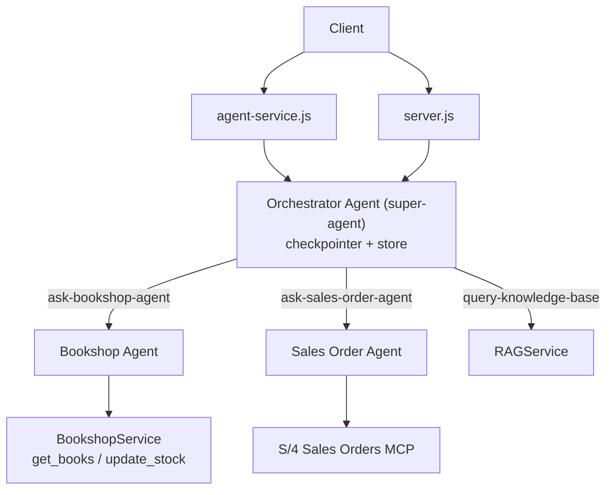

# Day 15: Break the Monolith into 3 Agents

Until now, everything lived in a single `bookshop-agent`. That agent handled books, sales orders, the knowledge base, memory, summarization, and human-in-the-loop — all at once.

On Day 15, we split that monolith into **three** agents, each with a clear job:

| Agent                              | Folder                | Job                                             |
| ---------------------------------- | --------------------- | ----------------------------------------------- |
| Orchestrator Agent (`super-agent`) | `orchestrator-agent/` | Routes requests, owns memory, queries the KB    |
| Bookshop Agent                     | `bookshop-agent/`     | Books: `get_books` + `update_stock` (with HITL) |
| Sales Order Agent                  | `salesorder-agent/`   | Reads S/4HANA sales orders via MCP              |

The orchestrator talks to the two sub-agents through two tools: `ask-bookshop-agent` and `ask-sales-order-agent`.

---

## Architecture



Key ideas:

- The **orchestrator** is the only agent the client talks to.
- The **orchestrator** is the only agent that holds memory (short + long term) and summarization.
- The **sub-agents** are one-off workers: they handle a single request and return a result.

---

## Step 0 - Folder layout

After this day, `agent/srv/agents/` looks like this:

```
agents/
├── bookshop-agent/
│   ├── agent.js
│   ├── middlewares.js
│   ├── skills.js
│   └── tools.js
├── orchestrator-agent/
│   ├── agent.js
│   ├── middlewares.js
│   └── tools.js
└── salesorder-agent/
    ├── agent.js
    ├── middlewares.js
    ├── skills.js
    └── tools.js
```

Notice:

- The **orchestrator** has no `skills.js` — it doesn't need a `load_skill` skill.
- Every other file (`agent.js`, `middlewares.js`, `tools.js`) exists in all three agents.

---

## Step 1 - Create the Sales Order Agent

The sales-order MCP logic moves out of `bookshop-agent` and into its own agent.

### `salesorder-agent/skills.js`

This is the `manage_salesorders` skill, moved unchanged from `bookshop-agent/skills.js`:

```javascript
import { context } from "langchain";

export const SKILLS = [
  {
    name: "manage_salesorders",
    description:
      "Schema and business logic for retrieving sales orders from the SAP S/4HANA system.",
    content: context`
    # Schema

    Access sales order data exclusively through the 'salesorder-mcp' MCP tools:
    - describe: returns the data model (entities, keys, elements, associations).
      Call this first whenever you are unsure which entities or fields exist -
      do not guess field names.
    - query: executes CAP CQL statements against the service. Only SELECT
      statements are allowed; the service is strictly read-only.

    ## Tables

    ### SalesOrders (header level)
    - SalesOrder: String(10), primary key (e.g. "1001")
    - SalesOrderType: String(4), e.g. OR = standard order
    - SalesOrganization / DistributionChannel / OrganizationDivision: org split
    - SoldToParty: String(10), customer number of the sold-to party
    - ShippingType
    - CreationDate: Date; CreatedByUser: String(12)
    - TotalNetAmount: Decimal(16,3), net value of the whole order
    - TransactionCurrency: currency key of all amount fields
    - PurchaseOrderByCustomer: customer reference / PO number
    - PaymentMethod
    - OverallSDProcessStatus: String(1) overall process status
    - to_Item: association (1-*) to SalesOrderItems

    ### SalesOrderItems (item/position level)
    Composite primary key: SalesOrder + SalesOrderItem
    - SalesOrderItemText
    - MaterialGroup / Material / MaterialByCustomer
    - RequestedQuantity: Decimal; RequestedQuantityUnit (e.g. PC)
    - NetAmount: Decimal(16,3), net value of the item
    - TransactionCurrency

    ## Relationships

    - One SalesOrders row has many SalesOrderItems rows (association to_Item).
    - Navigate with path expressions instead of SQL joins:
      SELECT from SalesOrders { ..., to_Item { ... } }
    - SalesOrderItems.SalesOrder is the foreign key back to the header, so items
      can also be queried directly filtered by SalesOrder.

    ## Business Logic

    1. Read-only: the query tool accepts only SELECT statements. Do not attempt
       INSERT, UPDATE, DELETE or DDL.
    2. Nested expands are written WITHOUT a colon before the brace:
       correct:   to_Item { SalesOrderItem, NetAmount }
       incorrect: to_Item: { SalesOrderItem, NetAmount }  (fails to compile)
    3. Amount fields are returned as strings ("2500.000"). Always report amounts
       together with their TransactionCurrency.
    4. OverallSDProcessStatus values: A = Open, B = In Process, C = Completed.
    5. Results are capped at roughly 1000 rows per query. Prefer precise filters
       over broad scans.
    6. Aggregated columns (sum/count in projections with GROUP BY) may not be
       returned reliably by this tool - only the group-by keys come back.
       For totals, fetch the rows and sum them up yourself.
    7. For item-level questions either expand to_Item on the header or query
       SalesOrderItems directly with a filter on SalesOrder.

    ## Example Query

    Header list:
    SELECT from SalesOrders { SalesOrder, SalesOrderType, CreationDate, TotalNetAmount, TransactionCurrency, OverallSDProcessStatus }

    Order incl. its items:
    SELECT from SalesOrders { SalesOrder, TotalNetAmount, TransactionCurrency, to_Item { SalesOrderItem, SalesOrderItemText, Material, RequestedQuantity, RequestedQuantityUnit, NetAmount } }

    Open orders only:
    SELECT from SalesOrders WHERE OverallSDProcessStatus = 'A'

    All items of one order:
    SELECT from SalesOrderItems WHERE SalesOrder = '1001'

    Orders created in August 2026:
    SELECT from SalesOrders WHERE CreationDate >= '2026-08-01' AND CreationDate <= '2026-08-31'`,
  },
];
```

### `salesorder-agent/tools.js`

The `getMcpTools()` helper and the `loadSkill` tool move here:

```javascript
import cds from "@sap/cds";
import { MultiServerMCPClient } from "@langchain/mcp-adapters";
import { tool } from "langchain";
import { z } from "zod";
import {
  resolveDestinationHeaders,
  resolveDestinationUrl,
} from "../../mcp/utils.js";
import { SKILLS } from "./skills.js";

const LOG = cds.log("salesorder-agent");

const getMcpTools = async () => {
  const destinationName = "mcp-salesorders-anselm";
  const mcpUrl = await resolveDestinationUrl(destinationName);

  const mcpClient = new MultiServerMCPClient({
    mcpServers: {
      "salesorder-mcp": {
        url: mcpUrl,
      },
    },
    beforeToolCall: async () => {
      const headers = await resolveDestinationHeaders(destinationName);
      return { headers: headers };
    },
  });

  return await mcpClient.getTools(["salesorder-mcp"], {
    headers: await resolveDestinationHeaders(destinationName),
  });
};

export const getTools = async () => {
  const mcpTools = await getMcpTools();

  return [...mcpTools];
};

export const loadSkill = tool(
  // runtime aspect
  async ({ skillName }) => {
    // Find and return the requested skill
    const skill = SKILLS.find((s) => s.name === skillName);
    if (skill) {
      LOG.info(`Loaded skill: ${skillName}`);

      return `Loaded skill: ${skillName}\n\n${skill.content}`;
    }

    // Skill not found
    const available = SKILLS.map((s) => s.name).join(", ");
    return `Skill '${skillName}' not found. Available skills: ${available}`;
  },

  // design time aspect
  {
    name: "load_skill",
    description: `Load the full content of a skill into the agent's context.

Use this when you need detailed information about how to handle a specific
type of request. This will provide you with comprehensive instructions,
policies, and guidelines for the skill area.`,
    schema: z.object({
      skillName: z.string().describe("The name of the skill to load"),
    }),
  },
);
```

### `salesorder-agent/middlewares.js`

Only the `skillMw` stays here — no summarization, no HITL, no state extension:

```javascript
import { createMiddleware } from "langchain";
import { SKILLS } from "./skills.js";
import { loadSkill } from "./tools.js";

// Build skills prompt from the SKILLS list
const skillsPrompt = SKILLS.map(
  (skill) => `- **${skill.name}**: ${skill.description}`,
).join("\n");

const skillMw = createMiddleware({
  name: "skillMiddleware",
  tools: [loadSkill],
  wrapModelCall: async (request, handler) => {
    // Build the skills addendum
    const skillsAddendum =
      `\n\n## Available Skills\n\n${skillsPrompt}\n\n` +
      "Use the load_skill tool when you need detailed information " +
      "about handling a specific type of request.";

    // Append to system prompt
    const newSystemMessage = request.systemMessage.concat(skillsAddendum);

    return handler({
      ...request,
      systemMessage: newSystemMessage,
    });
  },
});

export const getMiddlewares = async () => {
  return [skillMw];
};
```

### `salesorder-agent/agent.js`

```javascript
import { OrchestrationClient } from "@sap-ai-sdk/langchain";
import { context, createAgent } from "langchain";
import { getMiddlewares } from "./middlewares.js";
import { getTools } from "./tools.js";

const model = new OrchestrationClient({
  promptTemplating: {
    model: {
      name: "gpt-5.4",
    },
  },
});

export const getAgent = async () => {
  return createAgent({
    model: model,
    systemPrompt: context`
    You are a Sales Order Agent. You have access to an S/4HANA Sales Order system via an MCP server. 
    `,
    tools: await getTools(),
    middleware: await getMiddlewares(),
  });
};
```

Notice what this agent has **no** `checkpointer` and **no** `store`. That's on purpose — see the concept section at the end.

---

## Step 2 - Create the Orchestrator Agent

The orchestrator becomes the single entry point. It keeps memory, summarization, the KB tool, and the user-preference tools, and gains two new sub-agent tools.

### `orchestrator-agent/tools.js`

```javascript
import cds from "@sap/cds";
import { tool } from "langchain";
import { z } from "zod";
import { getAgent as getSalesOrderAgent } from "../salesorder-agent/agent.js";
import { getAgent as getBookshopAgent } from "../bookshop-agent/agent.js";

const LOG = cds.log("orchestrator-agent");

const queryKBTool = tool(
  // runtime aspect
  async ({ query }) => {
    LOG.info(
      `Querying Knowledge Base for SAP's AI Practical Use Cases with query: ${query}`,
    );

    const srv = await cds.connect.to("RAGService");

    const res = await srv.send({
      event: "query",
      data: { query: query, collectionName: "collection-anselm" },
    });

    return JSON.stringify(res);
  },

  // design time aspect
  {
    name: "query-knowledge-base",
    description: "Queries the Knowledge Base for SAP's AI Practical Use Cases",
    schema: z.object({
      query: z.string().describe("search query"),
    }),
  },
);

const getUserInfo = tool(
  async (_, config) => {
    const userId = config.state.userId;
    const tenantId = config.state.tenantId;

    LOG.info(
      `Retrieving user info for userId: ${userId}, tenantId: ${tenantId}`,
    );

    return `{"userId": "${userId}", "tenantId": "${tenantId}"}`;
  },
  {
    name: "get-user-info",
    description: "Get user info",
    schema: z.object({}),
  },
);

const saveUserPreferences = tool(
  async ({ text }, config) => {
    const userId = config.state.userId;

    await config.store.put(["users", "preferences"], userId, text);

    LOG.info(`Saved preferences for userId: ${userId}`);

    return `Preferences for user ${userId} saved successfully.`;
  },
  {
    name: "save-user-preferences",
    description: "Save user preferences",
    schema: z.object({
      text: z.string().describe("User preferences to save"),
    }),
  },
);

const getUserPreferences = tool(
  async (_, config) => {
    const userId = config.state.userId;

    const preferences = await config.store.get(
      ["users", "preferences"],
      userId,
    );

    LOG.info(
      `Retrieved preferences for userId: ${userId}: ${preferences?.value}`,
    );

    if (preferences) {
      return `Preferences for user ${userId}: ${preferences.value}`;
    } else {
      return `No preferences found for user ${userId}.`;
    }
  },
  {
    name: "get-user-preferences",
    description: "Get user preferences",
    schema: z.object({}),
  },
);

const askSalesOrderAgent = tool(
  async ({ query }) => {
    LOG.info(`Asking Sales Order Agent: ${query}`);

    const subagent = await getSalesOrderAgent();
    const res = await subagent.invoke({
      messages: [{ role: "user", content: query }],
    });
    return res.messages.at(-1)?.text || "No response from Sales Order Agent.";
  },
  {
    name: "ask-sales-order-agent",
    description: "Ask a question to the Sales Order Agent and get a response.",
    schema: z.object({
      query: z.string().describe("Query"),
    }),
  },
);

const askBookshopAgent = tool(
  async ({ query }) => {
    LOG.info(`Asking Bookshop Agent: ${query}`);

    const subagent = await getBookshopAgent();
    const res = await subagent.invoke({
      messages: [{ role: "user", content: query }],
    });
    return res.messages.at(-1)?.text || "No response from Bookshop Agent.";
  },
  {
    name: "ask-bookshop-agent",
    description: "Ask a question to the Bookshop Agent and get a response.",
    schema: z.object({
      query: z.string().describe("Query"),
    }),
  },
);

export const getTools = async () => {
  return [
    queryKBTool,
    getUserInfo,
    saveUserPreferences,
    getUserPreferences,
    askSalesOrderAgent,
    askBookshopAgent,
  ];
};
```

The two new tools, `ask-sales-order-agent` and `ask-bookshop-agent`, each:

1. import the sub-agent's `getAgent()`
2. invoke it with a single `messages` array
3. return the sub-agent's final `text` response

### `orchestrator-agent/middlewares.js`

The summarization and state-Extension middlewares move here:

```javascript
import { StateSchema } from "@langchain/langgraph";
import { OrchestrationClient } from "@sap-ai-sdk/langchain";
import { createMiddleware, summarizationMiddleware } from "langchain";
import { z } from "zod";

const model = new OrchestrationClient({
  promptTemplating: {
    model: {
      name: "gpt-5.4",
    },
  },
});

const summarizationMw = summarizationMiddleware({
  model: model,
  trigger: {
    tokens: 4000,
  },
  keep: {
    messages: 10,
  },
});

const UserState = new StateSchema({
  userId: z.string(),
  tenantId: z.string().optional(),
});

const stateExtMw = createMiddleware({
  name: "StateExtension",
  stateSchema: UserState,
});

export const getMiddlewares = async () => {
  return [summarizationMw, stateExtMw];
};
```

### `orchestrator-agent/agent.js`

```javascript
import { MemorySaver, InMemoryStore } from "@langchain/langgraph";
import { OrchestrationClient } from "@sap-ai-sdk/langchain";
import { context, createAgent } from "langchain";
import { getA2aServerUrl } from "../../a2a/a2a-utils.js";
import { getTools } from "./tools.js";
import { getMiddlewares } from "./middlewares.js";

const checkpointer = new MemorySaver(); // short-term memory
const store = new InMemoryStore(); // long-term memory

const model = new OrchestrationClient({
  promptTemplating: {
    model: {
      name: "gpt-5.4",
    },
  },
});

export const getAgent = async () => {
  return createAgent({
    model: model,
    systemPrompt: context`You are a helpful assistant. 
    
    You have 2 roles:
      1. Query the Knowledge Base for SAP's AI Practical Use Cases, when asked for.
      2. You have access to 2 distinct subagents. Determine which subagent is best suited to handle the request and forward the request to the appropriate subagent. The subagents are:
        - Bookshop Agent: Can provide information about books and update stock in the bookshop.
        - Sales Order Agent: Can retrieve sales orders in the SAP S/4HANA system.

    Important:
      - For every request, you must 
        a. read user preferences to tailor your responses
        b. If the user has preferences, save the preferences. 
      - While forwarding the request to the subagents for information, include the user preferences so that the subagents can provide personalized responses.
      - Respond back to the user in markdown format.
  `,
    tools: await getTools(),
    middleware: await getMiddlewares(),
    checkpointer: checkpointer,
    store: store,
  });
};

export const AgentCard = {
  name: "super-agent",
  description:
    "Provides information about books, allows updating stock, pulls sales orders from S/4, provides SAP's AI use cases and orchestrates subagents.",
  url: getA2aServerUrl(),
  provider: { organization: "Anselm", url: "https://example.com" },
  version: "1.0.0",
  capabilities: {
    streaming: true,
    pushNotifications: false,
    stateTransitionHistory: false,
  },
  defaultInputModes: ["text"],
  defaultOutputModes: ["text"],
  skills: [
    {
      id: "get-books",
      name: "Get Books",
      description: "Gets the list of books from the bookshop",
      tags: ["books"],
      examples: ["List all books", "List books with a minimum price of 20"],
      outputModes: ["text/plain"],
    },
    {
      id: "update-stock",
      name: "Update Stock",
      description: "Updates the stock of a book in the bookshop",
      tags: ["books", "stock"],
      examples: [
        "Increase stock of book with name - 'My book' by 5",
        "Decrease stock of book with ID 2 by 3",
      ],
      outputModes: ["text/plain"],
    },
    {
      id: "query-kb",
      name: "Query Knowledge Base",
      description:
        "Queries the Knowledge Base for SAP's AI Practical Use Cases",
      tags: ["knowledge base", "SAP", "AI"],
      examples: [
        "What are some practical use cases of AI in SAP?",
        "List AI use cases in SAP's Knowledge Base",
      ],
      outputModes: ["text/plain"],
    },
    {
      id: "get-sales-orders",
      name: "Get Sales Orders",
      description: "Retrieves sales orders from the SAP S/4HANA system",
      tags: ["sales orders", "SAP", "S/4HANA"],
      examples: [
        "Get all sales orders for customer ID 12345",
        "Retrieve sales orders created in the last 7 days",
      ],
      outputModes: ["text/plain"],
    },
  ],
  supportsAuthenticatedExtendedCard: false,
  protocolVersion: "0.3.0",
};
```

Note the `AgentCard`:

- renamed to `super-agent`
- description now covers sales orders, KB, and sub-agent orchestration
- skills list grew to four entries (books, stock, KB, sales orders)

---

## Step 3 - Trim the Bookshop Agent

The bookshop agent keeps only its books/stock responsibilities. Everything else was moved out.

### `bookshop-agent/skills.js`

Remove the `manage_salesorders` skill (now in `salesorder-agent`). Keep only `manage_bookshop`:

```javascript
import { context } from "langchain";

export const SKILLS = [
  {
    name: "manage_bookshop",
    description:
      "Business logic for managing a bookshop such as retrieving book information and updating stock.",
    content: context`
    # Bookshop Management

    ## Data Model

    Entity Books (served by BookshopService):
    - ID: Integer (primary key)
    - title: String(100)
    - author: Association to Authors
    - stock: Integer
    - price: Decimal(10,2)

    ## Tools

    ### get_books
    Retrieves books from the bookshop.
    - minPrice (optional number): only books with price >= minPrice are returned
    - maxPrice (optional number): only books with price <= maxPrice are returned
    - Both parameters may be combined to query a price range.
    - Returns a JSON array of books including ID, title, author, stock and price.

    ### update_stock
    Changes the stock of one book by an increment.
    - bookId (number): ID of the book to update
    - increment (number): positive value increases stock, negative value decreases it
    - Returns the new absolute stock value after the update.
    - Fails with 404 if no book with the given ID exists.

    ## Business Logic

    1. Never guess a book ID. If the user refers to a book by name or title,
       call get_books first and resolve the ID from its result.
    2. Check the current stock before decrementing it. Do not reduce stock below
       zero - if the requested decrement exceeds the current stock, inform the
       user instead of executing the update.
    3. After updating stock, always report the resulting new stock value to the user.
    4. For price-related questions, use the minPrice/maxPrice filters of get_books
       instead of retrieving all books and filtering manually.

    ## Examples

    - "List all books" -> get_books with no arguments
    - "Books cheaper than 20" -> get_books({ maxPrice: 20 })
    - "Increase stock of 'Beloved' by 5" ->
        1. get_books() to resolve 'Beloved' to ID 5
        2. update_stock({ bookId: 5, increment: 5 })
    `,
  },
];
```

### `bookshop-agent/tools.js`

Keep only `getBooksTool` + `updateStockTool` + `loadSkill`. Remove `getMcpTools`, `queryKBTool`, `getUserInfo`, `saveUserPreferences`, `getUserPreferences`:

```javascript
import cds from "@sap/cds";
import { tool } from "langchain";
import { z } from "zod";
import { SKILLS } from "./skills.js";

const LOG = cds.log("bookshop-agent");

const getBooksTool = tool(
  // runtime aspect
  async ({ minPrice, maxPrice }) => {
    const srv = await cds.connect.to("BookshopService");

    const query = SELECT.from("Books");

    if (minPrice !== undefined) {
      query.where("price", ">=", minPrice);
    }

    if (maxPrice !== undefined) {
      query.where("price", "<=", maxPrice);
    }

    const res = await srv.run(query);

    LOG.info(
      `Retrieved ${res.length} books from BookshopService with minPrice: ${minPrice}, maxPrice: ${maxPrice}`,
    );

    return JSON.stringify(res);
  },

  // design time aspect
  {
    name: "get_books",
    description: "Gets the list of books",
    schema: z.object({
      minPrice: z.number().describe("Minimum price to filter").optional(),
      maxPrice: z.number().describe("Maximum price to filter").optional(),
    }),
  },
);

const updateStockTool = tool(
  // runtime aspect
  async ({ bookId, increment }) => {
    const srv = await cds.connect.to("BookshopService");

    const res = await srv.send({
      event: "updateStock",
      entity: "Books",
      data: { increment },
      params: [{ ID: bookId }],
    });

    LOG.info(
      `Updated stock for book ID: ${bookId} with increment: ${increment}. New stock: ${res.stock}`,
    );

    return JSON.stringify(res);
  },

  // design time aspect
  {
    name: "update_stock",
    description: "Updates the stock of a book",
    schema: z.object({
      bookId: z.number().describe("ID of the book to update"),
      increment: z
        .number()
        .describe("Amount to increment/decrement the stock by"),
    }),
  },
);

export const getTools = async () => {
  return [getBooksTool, updateStockTool];
};

export const loadSkill = tool(
  // runtime aspect
  async ({ skillName }) => {
    // Find and return the requested skill
    const skill = SKILLS.find((s) => s.name === skillName);
    if (skill) {
      LOG.info(`Loaded skill: ${skillName}`);
      return `Loaded skill: ${skillName}\n\n${skill.content}`;
    }

    // Skill not found
    const available = SKILLS.map((s) => s.name).join(", ");
    return `Skill '${skillName}' not found. Available skills: ${available}`;
  },

  // design time aspect
  {
    name: "load_skill",
    description: `Load the full content of a skill into the agent's context.

Use this when you need detailed information about how to handle a specific
type of request. This will provide you with comprehensive instructions,
policies, and guidelines for the skill area.`,
    schema: z.object({
      skillName: z.string().describe("The name of the skill to load"),
    }),
  },
);
```

### `bookshop-agent/middlewares.js`

Keep `skillMw` + `humanInTheLoopMw`. Remove `summarizationMw` and `stateExtMw`:

```javascript
import {
  createMiddleware,
  humanInTheLoopMiddleware
} from "langchain";
import { SKILLS } from "./skills.js";
import { loadSkill } from "./tools.js";

// Build skills prompt from the SKILLS list
const skillsPrompt = SKILLS.map(
  (skill) => `- **${skill.name}**: ${skill.description}`,
).join("\n");

const skillMw = createMiddleware({
  name: "skillMiddleware",
  tools: [loadSkill],
  wrapModelCall: async (request, handler) => {
    // Build the skills addendum
    const skillsAddendum =
      `\n\n## Available Skills\n\n${skillsPrompt}\n\n` +
      "Use the load_skill tool when you need detailed information " +
      "about handling a specific type of request.";

    // Append to system prompt
    const newSystemMessage = request.systemMessage.concat(skillsAddendum);

    return handler({
      ...request,
      systemMessage: newSystemMessage,
    });
  },
});

const humanInTheLoopMw = humanInTheLoopMiddleware({
  interruptOn: {
    update_stock: {
      allowedDecisions: ["approve", "reject"],
      description: "🚨 Update stock requires approval ('approved'/'rejected')",
    },
  },
  descriptionPrefix: "Tool execution pending approval",
});

export const getMiddlewares = async () => {
  return [skillMw, humanInTheLoopMw];
};
```

### `bookshop-agent/agent.js`

Remove `MemorySaver`/`InMemoryStore` and `getA2aServerUrl`. Remove the `AgentCard` (it moved to the orchestrator). Keep a focused prompt:

```javascript
import { OrchestrationClient } from "@sap-ai-sdk/langchain";
import { context, createAgent } from "langchain";
import { getMiddlewares } from "./middlewares.js";
import { getTools } from "./tools.js";

const model = new OrchestrationClient({
  promptTemplating: {
    model: {
      name: "gpt-5.4",
    },
  },
});

export const getAgent = async () => {
  return createAgent({
    model: model,
    systemPrompt: context`You are a Bookshop Agent that can provide information about books and update stock in the bookshop.`,
    tools: await getTools(),
    middleware: await getMiddlewares(),
  });
};
```

Again — no `checkpointer`, no `store`, no `AgentCard`.

---

## Step 4 - Rewire the entry points

Both the REST service and the A2A server now point at the orchestrator.

### `agent-service.js`

```javascript
import cds from "@sap/cds";
import { getAgent } from "./agents/orchestrator-agent/agent.js";

export class AgentService extends cds.ApplicationService {
  init() {
    this.on("invoke", async (req) => {
      const { message } = req.data;

      const agentInputs = {
        messages: [{ role: "user", content: message }],
        userId: cds.context?.user?.id,
        tenantId: cds.context?.tenant,
      };

      const orchestratorAgent = await getAgent();
      const result = await orchestratorAgent.invoke(agentInputs, {
        configurable: {
          thread_id: cds.context.id,
        },
      });

      console.log(result.messages[result.messages.length - 1].content);

      return req.reply(result.messages[result.messages.length - 1].content);
    });

    return super.init();
  }
}
```

### `server.js`

```javascript
import { DefaultRequestHandler, InMemoryTaskStore } from "@a2a-js/sdk/server";
import { jsonRpcHandler, UserBuilder } from "@a2a-js/sdk/server/express";
import cds from "@sap/cds";
import express from "express";
import { LangChainAgentExecutor } from "./a2a/a2a-executor.js";
import {
  getAgent,
  AgentCard as OrchestratorAgentCard,
} from "./agents/orchestrator-agent/agent.js";

const LOG = cds.log("a2a-agent");

cds.on("bootstrap", async (app) => {
  const routerA2A = express.Router();
  routerA2A.use(cds.middlewares.before);

  const taskStore = new InMemoryTaskStore();

  const orchestratorAgent = await getAgent();
  const agentExecutor = new LangChainAgentExecutor(orchestratorAgent);

  // A2A JSON-RPC endpoint
  routerA2A.get(`/.well-known/agent.json`, (_, res) =>
    res.json(OrchestratorAgentCard),
  );

  routerA2A.use(
    "/",
    jsonRpcHandler({
      requestHandler: new DefaultRequestHandler(
        OrchestratorAgentCard,
        taskStore,
        agentExecutor,
      ),
      userBuilder: UserBuilder.noAuthentication,
    }),
  );
  app.use("/a2a", routerA2A);

  LOG.info(`A2A agent endpoint mounted:`);
  LOG.info(`  Orchestrator: GET  /.well-known/agent.json`);
});
```

---

## Key concept - per-invocation persistence

This is the most important mental model of the day.

> Use per-invocation persistence when each call to the subgraph is independent and the subagent doesn't need to remember anything from previous calls. This is the most common pattern, especially for multi-agent systems where subagents handle one-off requests like "look up this customer's order" or "summarize this document."
>
> Omit the checkpointer or set it to `None`. Each call starts fresh, but **within a single call** the subgraph inherits the parent's checkpointer and can use `interrupt()` to pause and resume.

From the LangChain docs.

Applied to this codebase:

| Concern                            | Orchestrator      | Bookshop  | Sales Order |
| ---------------------------------- | ----------------- | --------- | ----------- |
| `checkpointer` (short-term)        | ✅ `MemorySaver`   | ❌ omitted | ❌ omitted   |
| `store` (long-term)                | ✅ `InMemoryStore` | ❌ omitted | ❌ omitted   |
| `summarizationMw`                  | ✅                 | ❌         | ❌           |
| `stateExtMw` (`userId`/`tenantId`) | ✅                 | ❌         | ❌           |
| `get-user-info` / preferences      | ✅                 | ❌         | ❌           |
| HITL (`humanInTheLoopMw`)          | ❌                 | ✅ (stock) | ❌           |
| skills + `load_skill`              | ❌                 | ✅         | ✅           |

Why this split:

- The **orchestrator is the only agent that talks to the user**, so it's the only one that needs user preferences, user info, and summarization.
- Sub-agents are **one-off workers**. Each `ask-*` call is independent; they don't need to remember anything between calls.
- Within a single sub-agent call, the sub-agent still **inherits the parent's checkpointer**, so an `interrupt()` inside the sub-agent (like the bookshop's HITL on `update_stock`) can pause and resume correctly.

---

## Demo flow

Run the app and try each prompt. All requests now route through the orchestrator, which picks the right tool/sub-agent.

### 1. Bookshop

```json
{ "message": "List all books cheaper than 30" }
```

Expected: the orchestrator calls `ask-bookshop-agent`, which calls `get_books`.

### 2. HITL still works

```json
{ "message": "Increase stock for book 201 by 5" }
```

Expected: the bookshop sub-agent pauses for approval (`update_stock` → HITL), then resumes on `approve`.

### 3. Sales orders

```json
{ "message": "Show me the open sales orders" }
```

Expected: the orchestrator calls `ask-sales-order-agent`, which uses the MCP tools.

### 4. Knowledge base

```json
{ "message": "What are some SAP AI use cases in finance?" }
```

Expected: the orchestrator handles this directly via `query-knowledge-base`.

### 5. Memory still works

First save a preference, then ask another question in the same thread — the orchestrator reads the stored preference and personalizes the response.

## References

- [Day 13: Short-Term and Long-Term Memory in LangChain](./day-13.md)
- [Day 11: Refactoring Your Agent — Skills & Middleware](./day-11.md)
- [LangChain subgraphs & persistence](https://docs.langchain.com/oss/javascript/langchain/subgraphs)
- [LangGraph Checkpointers](https://langchain-ai.github.io/langgraphjs/concepts/persistence/)
